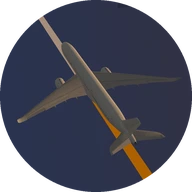
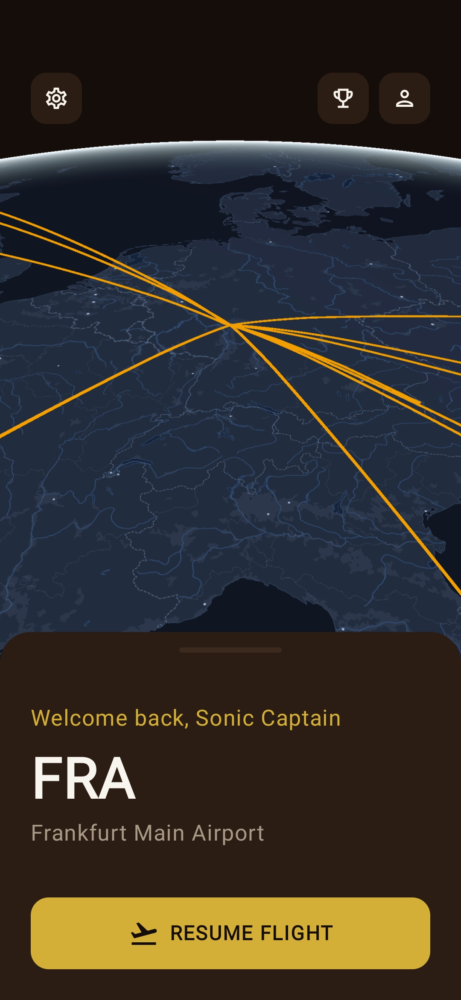
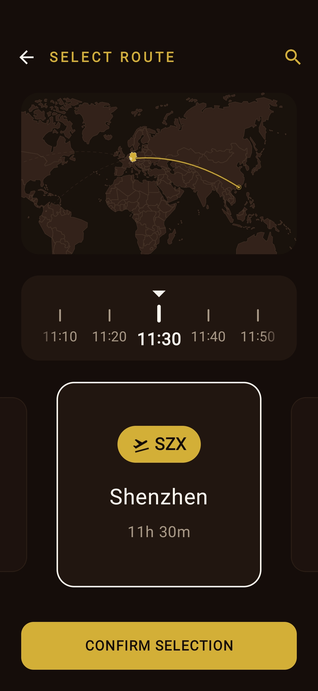
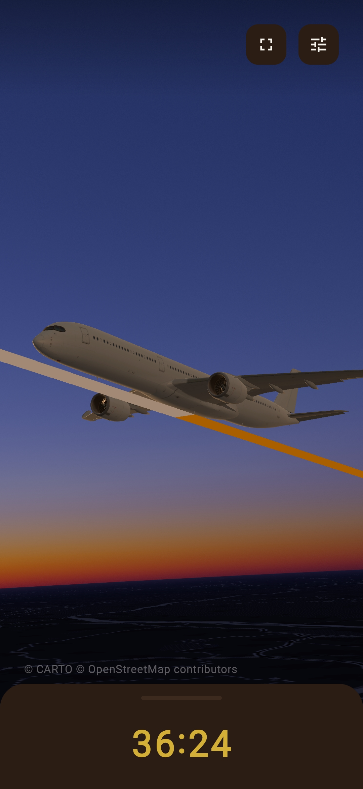
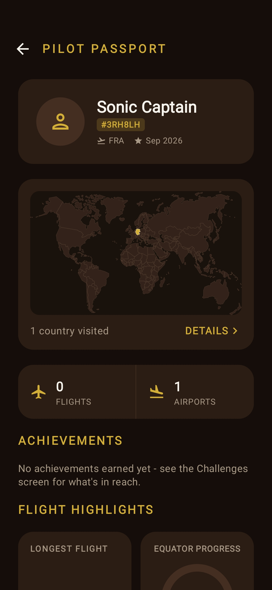

<div align="center">



# Blocktime

**A focus timer shaped like a flight.**

[](https://developer.android.com)
[](https://kotlinlang.org)
[](https://developer.android.com/jetpack/compose)
[](https://github.com/silas-270/CesiumRS)
[](LICENSE)

Book a real route, and the flight *is* your study session.<br>
Frankfurt to Stuttgart is a quick 45 minutes. London to Tokyo takes almost 14 hours.

&nbsp;
&nbsp;
&nbsp;


</div>

## How it works

1. **Book.** Pick a destination from your current airport. Every route is a real
   scheduled route between real airports, and its flight time is your session length.
2. **Board.** Check in, and the timer starts.
3. **Fly.** A live 3D globe follows your aircraft along the actual great-circle path,
   through climb, cruise and descent, with the sun setting and rising on the way. Watch
   from outside, follow the aircraft, or sit in the cockpit.
4. **Land.** The flight goes into your logbook and you are now *at* the destination. Your
   next session starts from there.

Crossing the world takes a real path across it, and that path is the game.

## Features

- **4,170 airports and 57,570 real routes**, bundled and fully offline
- **Story, Free and Challenge modes.** Story moves you around the world; Free flies
  anywhere without touching your progress; Challenges run their own isolated tracks
- **Challenges**: reach a far-off destination, complete a curated set (every continent,
  every G7 capital, …), fly a total distance, or keep a daily streak
- **Passport and achievements**: visited countries on a world map, distance milestones,
  and badges for the flights you take
- **Three map styles**: dark vector, satellite with 3D terrain, and a fully offline map
- **Engine sound** synthesised in real time from the flight's own thrust, with no recordings
- **No account, no ads, no analytics, no tracking.** Everything stays on your phone
  ([privacy policy](PRIVACY.md))

## Built with

Kotlin · Jetpack Compose · Material 3 · Room · a native Rust/wgpu engine,
[**CesiumRS**](https://github.com/silas-270/CesiumRS), linked through JNI and JNA.

## Building from source

You need Android Studio (or the Android SDK and JDK 21), the Android NDK, a Rust toolchain
with [`cargo-ndk`](https://github.com/bbqsrc/cargo-ndk), and a CesiumRS checkout (at `~/CesiumRS`
by default). The Gradle build cross-compiles the engine itself.

```bash
git clone https://github.com/silas-270/CesiumRS.git ~/CesiumRS
git clone https://github.com/silas-270/Blocktime.git
cd Blocktime

rustup target add aarch64-linux-android x86_64-linux-android
cargo install cargo-ndk

./gradlew :app:installDebug
```

| Environment variable | Purpose | Default |
|---|---|---|
| `CESIUM_RS_HOME` | Path to the CesiumRS checkout | `~/CesiumRS` |
| `ANDROID_NDK_HOME` | NDK to build against | derived from `ANDROID_HOME` |

API keys are optional and go in the untracked `local.properties`:

```properties
CARTO_API_KEY=…    # dark map tiles (otherwise watermarked)
ESRI_API_KEY=…     # licensed satellite imagery (otherwise the keyless service)
PEXELS_API_KEY=…   # destination photo on arrival (otherwise skipped)
```

The offline map needs none of them.

### Tests

```bash
./gradlew test                    # JVM unit tests
./gradlew connectedAndroidTest    # on a device: database migrations, route catalog
```

## Documentation

[`docs/`](docs/README.md) is a technical analysis of how the app works and why it is built that
way: architecture and navigation, the core loop and paused flights, modes, challenges and
achievements, persisted state, the flight database and route network, airport time zones, the
native engine bridge, maps and offline mode, the synthesised engine sound, and the UI scale.

## License

The code is released under the [MIT License](LICENSE). Bundled data, maps and models keep
their own licenses (OpenFlights ODbL, OurAirports, Natural Earth, Creative Commons models
and more); see [THIRD_PARTY_NOTICES.md](THIRD_PARTY_NOTICES.md).
