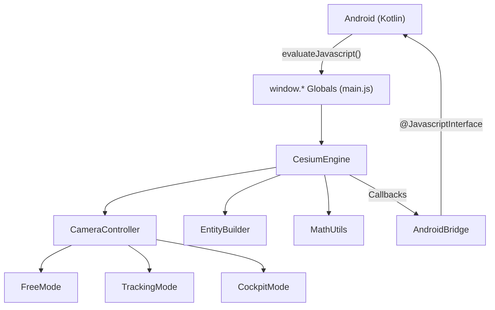

# FocusFlight Engine — API Reference

> Complete interface documentation for the CesiumEngine rendering layer.
> All functions are exposed as `window.*` globals and can be called from Android via `evaluateJavascript()`.

---

## Architecture Overview



---

## 1. Telemetry

### `loadTelemetry(points)`

Loads a pre-computed flight path and starts the visualization. Can be called multiple times — previous flights are cleaned up automatically.

| Parameter | Type | Description |
|---|---|---|
| `points` | `TelemetryPoint[]` | Array of waypoints (min. 2 required) |

#### TelemetryPoint Format

```typescript
interface TelemetryPoint {
    timeOffsetMs: number;   // Time since flight start in milliseconds
    longitude:    number;   // Degrees (-180 to 180)
    latitude:     number;   // Degrees (-90 to 90)
    altitude:     number;   // Meters above sea level (0 = ground)
}
```

#### Beispiel

```javascript
window.loadTelemetry([
    { timeOffsetMs: 0,         longitude:  9.222,  latitude: 48.689, altitude: 0     },
    { timeOffsetMs: 30000,     longitude:  9.250,  latitude: 48.710, altitude: 3000  },
    { timeOffsetMs: 120000,    longitude:  9.400,  latitude: 48.900, altitude: 8000  },
    // ... Reiseflughöhe ...
    { timeOffsetMs: 36000000,  longitude: -73.778, latitude: 40.641, altitude: 0     }
]);
```

#### Hinweise zur Punktdichte

| Flugphase | Empfohlener Abstand | Grund |
|---|---|---|
| Start / Landung | 500ms – 2s | Hohe Höhenänderung, sichtbar nah |
| Kurven | 1s – 5s | Richtungsänderung muss smooth sein |
| Geradeaus (Cruise) | 10s – 60s | Kaum visuelle Veränderung, spart Speicher |

> [!IMPORTANT]
> Die Engine interpoliert **linear** zwischen allen Punkten. Je dichter die Punkte in Kurven gesetzt werden, desto weicher sieht die Flugbahn aus. Auf langen Geraden reichen wenige Punkte, da die Erdkrümmung durch die große Anzahl ohnehin kaum sichtbar abweicht.

---

## 2. Kamera

### `setMode(modeId)`

Wechselt die Kameraperspektive mit einer smoothen 1.5s Übergangsanimation.

| Parameter | Type | Werte |
|---|---|---|
| `modeId` | `string` | `'FREE'` \| `'TRACKING'` \| `'COCKPIT'` |

#### Modi im Detail

| Modus | Beschreibung | User-Interaktion | Verhalten bei erneutem Klick |
|---|---|---|---|
| `FREE` | Gesamte Route von oben sichtbar. User kann frei zoomen, drehen, schwenken. | ✅ Voll interaktiv | Kamera fliegt zurück zur Übersicht |
| `TRACKING` | Kamera folgt dem Flugzeug mit festem Offset (-45° Heading, -22° Pitch, 500m Distanz). | ✅ Zoom & Rotation möglich (bricht zu FREE) | Kamera springt zurück zum Standard-Offset |
| `COCKPIT` | Ego-Perspektive aus dem Cockpit. Kein User-Input möglich. Flugzeug & Linie werden aus Performance-Gründen ausgeblendet. | ❌ Gesperrt | Kein Effekt |

#### Beispiel

```javascript
window.setMode('TRACKING');
```

> [!NOTE]
> Im TRACKING-Modus wird das Flugzeug über Cesiums native `trackedEntity`-Logik verfolgt. Wenn der User die Kamera manuell zieht, bricht das Tracking automatisch ab und es wird in den FREE-Modus gewechselt. Android wird darüber via `onCameraModeChanged('FREE')` informiert.

---

## 3. Kartenstil

### `setMapStyle(styleId)`

Wechselt den Imagery-Layer des Globus. Kann jederzeit aufgerufen werden, auch während eines laufenden Fluges.

| Parameter | Type | Werte |
|---|---|---|
| `styleId` | `string` | `'OSM'` \| `'DARK'` \| `'NIGHTLIGHTS'` \| `'HYBRID'` |

#### Styles im Detail

| Style | Quelle | Netzwerk | Performance | Beschreibung |
|---|---|---|---|---|
| `DARK` | Keine (nur `baseColor`) | ❌ Offline | ⭐⭐⭐ Maximum | Dunkler Globus ohne Texturen. Ideal für maximale FPS. |
| `OSM` | OpenStreetMap Tiles | ✅ Online | ⭐⭐ Gut | Standard-Kartentiles mit Straßen und Labels. |
| `NIGHTLIGHTS` | Cesium Built-in NaturalEarthII | ❌ Offline (bundled) | ⭐⭐ Gut | Natürliche Erdfarben mit dynamischer Tag/Nacht-Beleuchtung. |
| `HYBRID` | ArcGIS Satellite | ✅ Online | ⭐ Normal | Hochauflösende Satellitenbilder. Default. |

#### Beispiel

```javascript
window.setMapStyle('DARK');
```

> [!TIP]
> `DARK` is ideal for Langstreckenflüge auf schwächeren Geräten: Null Tile-Downloads, null Textur-Dekodierung, null Netzwerk-Latenz. Der Globus zeigt nur die dunkelblaue Grundfarbe (`#001133`).

---

## 4. Playback

### `play()`

Startet die Fluganimation oder setzt sie nach einem `pause()` fort.

```javascript
window.play();
```

---

### `pause()`

Pausiert die Fluganimation. Das Flugzeug friert exakt an seiner aktuellen Position ein. Alle Kameramodi funktionieren weiterhin.

```javascript
window.pause();
```

---

### `setSpeedMultiplier(mult)`

Setzt den Geschwindigkeitsmultiplikator der Simulation.

| Parameter | Type | Beschreibung |
|---|---|---|
| `mult` | `number` | `1` = Echtzeit, `2` = doppelte Geschwindigkeit, `0.5` = halbe Geschwindigkeit |

```javascript
window.setSpeedMultiplier(5); // 5-fache Geschwindigkeit
```

> [!NOTE]
> Der Multiplier beeinflusst nur die Simulationsuhr. Kamera-Übergangsanimationen (1.5s) laufen immer in Echtzeit, unabhängig vom Multiplier.

---

### `seekTo(fraction)`

Springt zu einer bestimmten Stelle im Flug.

| Parameter | Type | Beschreibung |
|---|---|---|
| `fraction` | `number` | `0.0` = Flugstart, `0.5` = Hälfte, `1.0` = Flugziel |

```javascript
window.seekTo(0.75); // Springt auf 75% des Fluges
```

> [!WARNING]
> Bei einem Sprung aktualisiert sich die Flugzeugposition sofort. Wenn du dich im TRACKING- oder COCKPIT-Modus befindest, springt die Kamera mit. Im FREE-Modus ändert sich nur die Flugzeugposition auf der Karte.

---

## 5. Android Bridge Callbacks

Die Engine ruft automatisch folgende Methoden auf dem `AndroidBridge`-Interface auf, wenn bestimmte Events eintreten:

| Callback | Wann | Parameter |
|---|---|---|
| `onEngineInitialized()` | Cesium Viewer ist bereit | — |
| `onFlightStarted()` | `loadTelemetry()` hat Entities erstellt | — |
| `onCameraModeChanged(modeId)` | Kameramodus hat sich geändert (auch intern, z.B. Tracking-Break) | `string`: `'FREE'` \| `'TRACKING'` \| `'COCKPIT'` |
| `onMapStyleChanged(styleId)` | Kartenstil wurde gewechselt | `string`: `'OSM'` \| `'DARK'` \| `'NIGHTLIGHTS'` \| `'HYBRID'` |

#### Kotlin-Implementierung

```kotlin
class CesiumBridge(private val activity: FlightActivity) {

    @JavascriptInterface
    fun onEngineInitialized() {
        activity.runOnUiThread { /* Engine bereit, UI freischalten */ }
    }

    @JavascriptInterface
    fun onFlightStarted() {
        activity.runOnUiThread { /* Flug gestartet, Controls anzeigen */ }
    }

    @JavascriptInterface
    fun onCameraModeChanged(modeId: String) {
        activity.runOnUiThread { /* Button-State aktualisieren */ }
    }

    @JavascriptInterface
    fun onMapStyleChanged(styleId: String) {
        activity.runOnUiThread { /* Dropdown aktualisieren */ }
    }
}

// In der Activity:
webView.addJavascriptInterface(CesiumBridge(this), "AndroidBridge")
```

---

## 6. Komplettes Nutzungsbeispiel (Kotlin)

```kotlin
// 1. Engine initialisiert sich automatisch beim Laden der HTML.
//    Warte auf onEngineInitialized().

// 2. Telemetrie-Daten laden (z.B. aus deinem Algorithmus):
val telemetryJson = """[
    {"timeOffsetMs": 0,      "longitude": 9.222,  "latitude": 48.689, "altitude": 0},
    {"timeOffsetMs": 30000,  "longitude": 9.250,  "latitude": 48.710, "altitude": 3000},
    {"timeOffsetMs": 120000, "longitude": 9.400,  "latitude": 48.900, "altitude": 8000},
    {"timeOffsetMs": 3600000,"longitude": -73.778, "latitude": 40.641, "altitude": 0}
]"""
webView.evaluateJavascript("window.loadTelemetry($telemetryJson)", null)

// 3. Kameramodus setzen:
webView.evaluateJavascript("window.setMode('TRACKING')", null)

// 4. Kartenstil wechseln:
webView.evaluateJavascript("window.setMapStyle('DARK')", null)

// 5. Playback steuern:
webView.evaluateJavascript("window.pause()", null)
webView.evaluateJavascript("window.setSpeedMultiplier(5)", null)
webView.evaluateJavascript("window.seekTo(0.5)", null)
webView.evaluateJavascript("window.play()", null)
```

---

## 7. Dateistruktur

```
assets/
├── index.html                     # HTML Shell
├── css/style.css                  # Styling
├── models/A350.glb                # 3D Flugzeugmodell
└── js/
    ├── main.js                    # Entry Point, window.* Globals
    ├── CesiumEngine.js            # Kern-Engine (Public API)
    ├── CameraController.js        # Kameramodus-Management
    ├── EntityBuilder.js           # Entity-Konstruktion (Korridore, Modell, Tracker)
    ├── MathUtils.js               # Skalierung & Orientierung
    └── modes/
        ├── CameraMode.js          # Abstrakte Basisklasse
        ├── FreeMode.js            # Freie Kamera
        ├── TrackingMode.js        # Verfolgungskamera
        └── CockpitMode.js        # Cockpit-Perspektive
```
