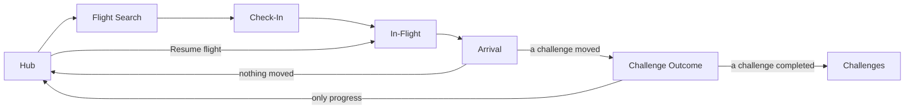
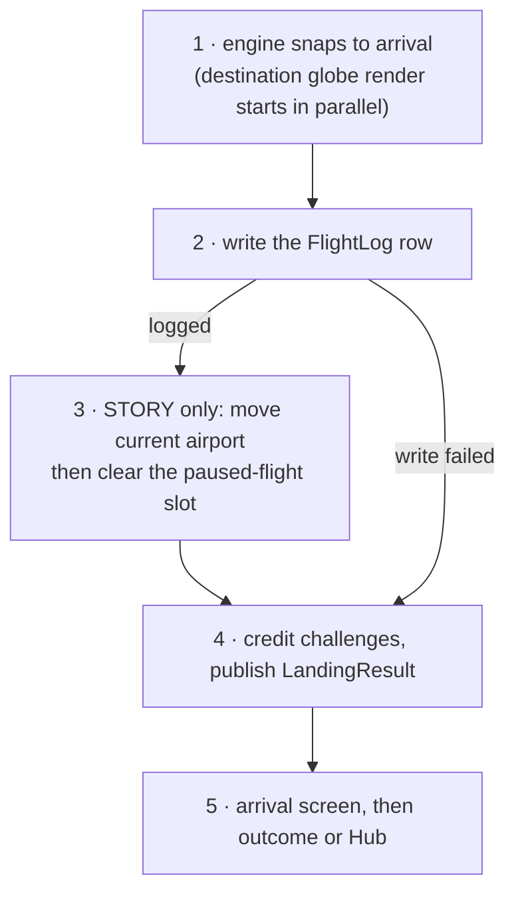

# The core loop

One session: pick a route, board, fly it for its real scheduled duration, land. Everything
else in the app (modes, challenges, achievements, the passport) hangs off this loop, and none of
it is allowed to make the loop harder to reach.

The navigation mechanics behind these arrows are in [navigation.md](navigation.md). This file
follows what happens at each stop.

## 1 · Hub

The home screen. It shows the pilot's current airport over a rendered globe of that airport's
outbound routes, their flight count, total flight time and airports visited, and one primary
button: **Resume flight** if a paused flight exists, otherwise **Book a flight**.

The globe is a pre-rendered PNG from the headless renderer, requested with `reuseCachedFile =
true` so an airport the pilot has seen recently appears instantly instead of being re-rendered on
every visit ([maps.md](maps.md#headless-globe-renders)). Tapping it books from here, like the
button, because the arcs on it are exactly the destinations on offer.

**A focused Route challenge takes over the Hub.** When `focused_route_challenge_id` points at an
active Route challenge, the Hub shows that challenge's position (`positionIata`), its progress
card and its own paused flight, instead of the Story-mode airport and slot. The pointer is a
display preference and never changes the challenge row. `HubViewModel` validates it on every
load and clears it if the challenge has been completed or abandoned elsewhere, so a stale id can
never strand the Hub. Booking while a challenge is focused continues that challenge rather than
Story Mode ([navigation.md](navigation.md#shared-entry-points)).

If a paused flight exists and the pilot books a new one anyway, the Hub asks first: starting a
new flight overwrites the paused one ([paused-flights.md](paused-flights.md)).

Because the Hub's back-stack entry survives trips to other screens, and a screen like Settings
can move the pilot (return home), the Hub reloads on every `ON_START` rather than only on first
creation.

## 2 · Flight Search

Picks the route. The origin is fixed by the mode: the pilot's current airport in Story Mode, the
challenge's position pointer for a challenge leg, and a free choice (with the same airport picker
as onboarding) in Free Mode.

Two ways to search, toggled at the top:

- **By time.** A horizontal timeline of ten-minute duration buckets, built only from buckets
  that contain at least one route. Scrolling snaps to the nearest bucket and selects its first
  route. This is the mode that matches how the app is used: "I have 90 minutes" is the real
  question far more often than "where do I want to go".
- **By airport.** Free-text search over the destinations on offer, matching IATA code, airport
  name, city, and the start of the country name, all accent-insensitive.

The routes of the selected bucket are paged as cards, synced both ways with the timeline:
swiping the pager changes the selection, and picking a bucket resets the pager to its first card.
Tapping a partly visible neighbour pages to it; tapping the centred card books it, the same as
**Confirm selection**.

Only destinations inside the main route network are offered, and only physically plausible
routes, one per destination ([route-network.md](route-network.md)). If a Story-mode origin turns
out to be a dead end with no routes at all, the pilot is moved to the nearest large network
airport and told so on screen ([route-network.md](route-network.md#the-dead-end-rescue)).

Confirming pushes the route into the engine through `PendingFlightLoader` and navigates to
Check-In.

## 3 · Check-In

The boarding pass: pilot name, origin and destination, flight number, date, duration and
distance. The 3D engine starts rendering behind it; this is the first of the two routes on which
native rendering is enabled.

A route lookup that fails degrades instead of crashing. `loadRouteContext` treats a failed query
exactly like "no such route", because both of its callers run it in a plain
`viewModelScope.launch` where an escaping exception would take down the process, and neither has
anything better to do with it. The pass then renders without a distance, and since starting needs
the route's duration, **Start flight** stays disabled with a note asking the pilot to go back and
pick the flight again.

Starting writes a fresh paused-flight record into the session's slot, waits for the write to
finish, and only then navigates to In-Flight, popping Check-In. The ordering matters: the write
runs in the Check-In screen's coroutine scope, and popping the screen first would cancel it
([paused-flights.md](paused-flights.md#starting-a-flight)).

## 4 · In-Flight

The session itself, and the only screen that allows rotation.

### The clock

`InFlightViewModel` runs a timer coroutine that ticks every 33 ms and advances the elapsed time by
the real time that passed (`SystemClock.elapsedRealtime()` deltas, not tick counts, so a late
tick cannot slow the flight). Each tick it pushes `nativeSetProgress(elapsed / total)` to the
engine and reads `nativeGetTelemetry()` back for the HUD's position, altitude and speed.
**Progress is the only thing the app tells the engine about time.** Position, attitude, camera
and lighting are all derived by the engine from that one number; the app never interpolates the
route itself.

A fresh flight starts with elapsed time at −3,000 ms. The first three seconds are a countdown
overlay while progress is held at zero, giving the camera and the pilot a moment on the runway.
At the other end the clock runs 3,000 ms past the total before it lands. During that end hold
the timer reads "LANDING…", and both the settings panel and system back are disabled, because
leaving in that window would exit without logging a flight that has already been flown.

The HUD shows the local time at both airports: departure as the wall-clock moment the session
effectively started, arrival as now plus the remaining time, so a pause pushes the arrival later
just as a delay would ([time-zones.md](time-zones.md)).

### Everything else on the screen

- **Camera modes** Free, Chase and Cockpit. A new flight starts in Chase.
- **Map styles** dark map, satellite with 3D terrain, and the built-in offline map, with the
  network styles locked while the app is offline ([network.md](network.md#the-live-globe)).
- **Route line** full, a window around the aircraft, or hidden ([engine.md](engine.md#the-call-surface)).
- **Engine sound**, synthesised from the flight's own telemetry ([engine-sound.md](engine-sound.md)).
- **Scenic mode**, which clears the HUD down to the bare timer.
- The screen stays awake on Check-In and In-Flight only; `CesiumGameActivity` sets and clears
  `FLAG_KEEP_SCREEN_ON` from the current route, so no screen can clear it for another.

The pilot leaves through the settings panel's SLIDE TO LEAVE control or system back. Both pause
the timer and open a "LEAVE FLIGHT?" dialog whose primary button is RESUME. The dialog says where
the flight can be picked up again, which depends on the mode's paused-flight slot: the Hub for
Story, Free Mode on the Challenges screen for Free, and the Hub or the challenge itself for a
challenge leg ([paused-flights.md](paused-flights.md)).

### Rank

The rank stamped on arrival is a pure function of the booked duration, computed on the screen
when the flight completes:

| Duration | Rank |
|---|---|
| ≥ 8 h | GLOBETROTTER |
| ≥ 4 h | COMMANDER |
| ≥ 2 h | CAPTAIN |
| < 2 h | CO-PILOT |

## The post-landing pipeline

Landing is a five-step pipeline whose **order is a correctness property**. Several KDoc comments
refer to its steps by number.

`InFlightViewModel.completeFlight()` runs steps 1 to 4. It is reached when the timer passes the
end hold and from the debug menu's skip button, and it is guarded by a `landingStarted` flag,
because two landings would log the flight twice and credit challenges twice.

**Step 1: the engine snaps to arrival.** `nativeSetProgress(1.0)`, and the destination's globe
render starts immediately. The render is the slowest part of the landing by far and depends on
none of the data writes, so it runs alongside them; the destination's Hub globe is then usually
ready when the pilot gets there.

The remaining steps run strictly in sequence in `landingScope`, an IO scope the ViewModel does
not own the lifetime of. Navigating to the arrival screen pops In-Flight and cancels
`viewModelScope` within moments of the landing starting, so work launched there would race its
own destruction. `onCleared()` instead waits for the landing and render jobs to finish and only
then cancels `landingScope`. This does rely on one ordering: `completeFlight()` has to launch its
jobs before, or in the same synchronous step as, the `isCompleted = true` emission that triggers
navigation. Both call sites do, with no suspension point in between.

**Step 2: write the logbook entry.** The `FlightLog` row is the flight's only durable record,
so it goes first and everything that follows is conditional on it. Its distance is the route's
own figure, or the great-circle distance between the two airports if the route lookup came back
empty, so a flight that really was flown is never logged as 0 km.

**Step 3: move the pilot.** Only if step 2 succeeded. For a Story session the current airport
moves to the destination; for every session the paused-flight slot is cleared. If step 2 failed,
both are left alone on purpose. A pilot still at the origin with a resumable flight is in a
consistent state they can act on. A pilot standing at a destination with no flight explaining how
they got there is not repairable, because the logbook is the only record of movement.

**Step 4: credit challenges.** Always runs, even after a failed logbook write, because it is
what resolves `LandingResultChannel`, and the arrival screen waits on that channel. A landing
that could not be logged or a Free Mode landing publishes `LandingResult.None` straight away.
Otherwise it snapshots the active challenges, runs `processLandingForChallenges`, re-reads each
snapshotted challenge by id, and diffs the two with `resolveLandingOutcome`. The re-read is by id
rather than "list the active ones again" because a challenge completed by this landing is no
longer active and would vanish from the diff. The whole step sits in one `try`, and any failure,
cancellation included, publishes `None`: a degraded result is always better than a channel that
never resolves. The crediting rules are in [challenges.md](challenges.md#which-flights-count).

Achievements have no step here. Every achievement is a pure function of the flight log and the
home airport, so the logbook write in step 2 is all it takes for them to update: Room re-emits
the flight log, `PilotProgressRepository` recomputes, and unlock timestamps are stamped on that
read path ([achievements.md](achievements.md)).

**Step 5: show the outcome.** The arrival screen always plays first. Its CONTINUE button waits
for the channel to resolve, up to `LANDING_RESULT_TIMEOUT_MS` (5 s), and then:

- `LandingResult.ChallengesAffected` leads to the Challenge Outcome screen, which animates each
  challenge's bar from its old value to its new one;
- `LandingResult.None` goes straight to the Hub.

The timeout bounds a pathological case rather than racing a healthy check, which resolves well
within it. If it is ever reached, the pilot continues to the Hub and the event is logged.

## 5 · Arrival

A full-screen destination photo when one was fetched during the flight
([network.md](network.md#destination-photos)), "Welcome to <city>", and a passport-style rank
stamp. 120 ms after the screen appears the stamp slams down from four times its size on a bouncy
spring, the rest of the screen fades in over 300 ms, and the device gives a haptic pulse. Below
it, "FOCUSED FOR" and the session length.

The button reads CONTINUE rather than naming a destination, because it leads to the Challenge
Outcome screen when a challenge moved. It only responds once it has fully faded in, so a stray
tap cannot skip the celebration, and it disables itself after the first tap while the landing
result is awaited. When a photo is shown, the photographer credit Pexels requires sits above it.

## 6 · Challenge Outcome

One card with one progress bar per affected challenge; a single landing can move up to three.
Each bar animates from its old fraction to its new one, and completions end with confetti. The
bars are labelled in each challenge's own units ("Leg 3/5", distances in miles) where the current
row can be read, and as a percentage otherwise. If any challenge completed, CONTINUE opens the
Challenges screen, where the completion presentation plays
([challenges.md](challenges.md#completion-presentation)); otherwise it returns to the Hub.

## What the loop does not do

There is no fast travel. Position moves only by flying, which is what gives the world map its
meaning. The two exceptions, returning home and changing the home base, are both deliberate and
both on cooldowns ([modes.md](modes.md#the-two-cooldowns)).
