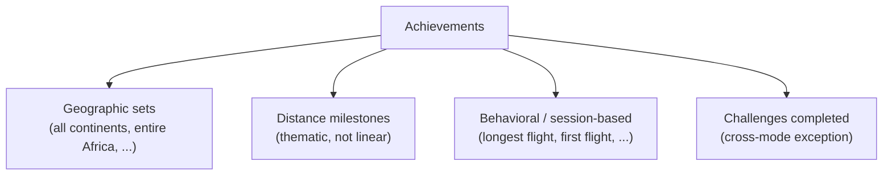

# Achievements

**Status: 🟢 decided.**

Recognition for what you've actually accomplished, not a busywork
counter. Category-based, surfaced inside the existing Account screen.

## Shape at a glance

Four category types for v1. Same approach as the challenge types in
[challenges.md](challenges.md): defining the *category types* here,
not authoring the exhaustive item-by-item list — that's later content
work, not a design decision.

## Why category-based, not counters

Known failure mode: shipping dozens of trivial linear achievements
("fly 1 flight," "fly 5 flights," "fly 10 flights") that feel like
busywork instead of recognition. Category-based achievements
(geographic sets, thematic distance milestones, behavioral moments)
are naturally varied, more visible as real accomplishments, and don't
need to be numerous to feel substantial.

## Categories

### Geographic sets

E.g. "all continents," "all countries," "entire Africa," "entire
Europe." Progress = count of set members reached / total set size —
structurally the same metric as Set-completion challenges.

Existing groundwork: `FlightSearchViewModel` already computes
`visitedCountries` and `completedContinents` today (for the world-map
UI), so this category has a head start on the tracking side once it's
time to build — not a design factor, just useful context for later.

### Distance milestones

Thematic, not linear — a few big, flavorful ones rather than boring
"fly 1/5/10 flights" counters. E.g. "flown around the world" (40,075
km), "to the moon" (384,400 km). Exact milestone list is content work,
not a design decision.

### Behavioral / session-based

Adds personality beyond pure geography/distance. E.g. longest single
flight, first flight ever, a session started late at night. Exact list
is content work, same as above.

### Challenges completed

Cross-mode exception — see [Scope & isolation](#scope--isolation) and
[challenges.md](challenges.md). Revised 2026-08-27: not a counter
against a fixed total. Every completed challenge (curated or custom,
including repeat completions of the same one) is appended to a single
completed-challenges log — modeled on the flight logbook, not an
"x/N" tally, since custom challenges and repeats mean there's no fixed
denominator.

## Relationship to Challenges

Confirmed 2026-08-27. Achievements and Challenges share a mental
model: an achievement is basically a non-repeatable challenge that
auto-starts the first time the app is opened, instead of being
manually picked and capped at 3 active slots. That's why Set-
completion achievements (e.g. geographic sets) read persistent,
ever-accumulating Story Mode state while the equivalent Set-completion
*challenge* deliberately starts at zero each time — see
[challenges.md](challenges.md#isolation) — a challenge needs to
stay meaningfully replayable, an achievement doesn't.

Mechanically, both are driven by the same hook: a single check runs
after every eligible flight lands and evaluates it against all
achievements and all active challenges in one pass. Which flights are
eligible is governed by the mode tag, canonical in
[mechanics.md](mechanics.md#the-isolation-matrix) — Free Mode flights
are excluded from both, though they still appear in the logbook.

## Scope & isolation

Story Mode only, with **one confirmed exception**: completed
challenges get their own recognition category here (previous section).
That exception is display/recognition only, not functional — it
doesn't grant visited-airports, stats, or anything Story-Mode-scoped.
Free Mode still feeds nothing here.

## Surfacing

A section within the existing Account/Passport screen, not a new
top-level destination — reuses existing screen/nav structure. Revisit
a dedicated screen later if the list grows large enough to need one.

## Reveal style

Locked (not-yet-earned) achievements are **fully visible with
progress shown** — you can always see what's left to do and how close
you are. Fits a goal-directed study app better than mystery/"???"
placeholders, which give players less of a clear target. Mystery
achievements could be added later as a separate, explicitly-secret
category if ever wanted, but nothing planned for v1.

## Open items

None currently.
