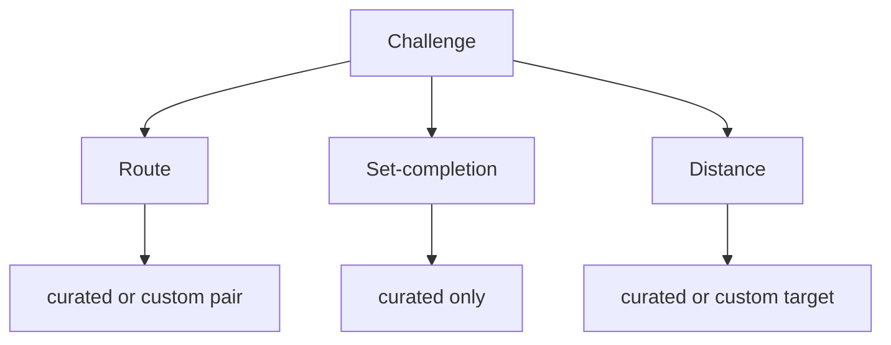
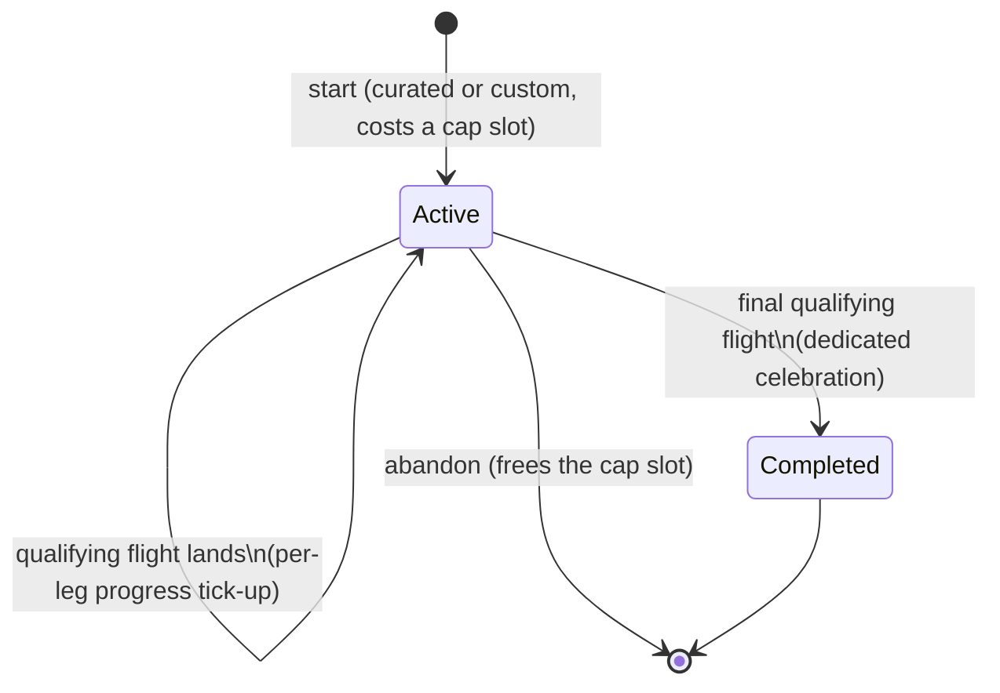
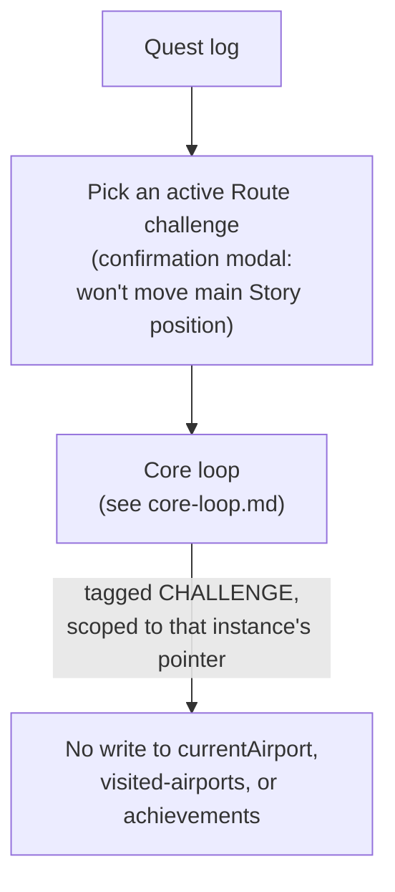

# Challenges

**Status: 🟢 decided.**

A challenge is a long-running goal worked on across many sessions,
presented like a quest log (multiple active challenges, pick one to
continue). Isolated from Story Mode progress, with one narrow
exception for completion recognition (see [Isolation](#isolation-1)).

## Shape at a glance



Three types, each with its own progress metric because the underlying
goals are genuinely different shapes. This is the complete v1 list —
no other types planned.

## Types

### Route

E.g. "London → Sydney." Departure-to-destination, using the same
real-route pathfinding Story Mode uses.

#### Mechanic

The flight database only contains real, currently-scheduled routes
(updated weekly) — no fictional legs, no authored waypoint chains. So
a Route challenge is the same positional mechanic as Story Mode: you're
at an airport, you pick a real onward flight, your position advances —
just with its own isolated position-pointer instead of the one
permanent global Story Mode position, and the destination airport as
the win condition. No new "flying" UI — reuses Story Mode's existing
flight-picking screen, scoped to the challenge's own position.

This makes it a genuine pathfinding puzzle ("how do I actually get
from London to Sydney using real connections") rather than busywork,
and reuses Story Mode's position-advancement logic directly.

Confirmed 2026-08-27: a Route-challenge flight never writes
`currentAirport` (see [mechanics.md](mechanics.md)). Because that's a
surprising outcome from the player's seat — a real flight lands
somewhere but their main Story position doesn't move — choosing
"continue" on a Route challenge shows a small confirmation modal
before entering the booking flow, making that explicit up front. Exact
modal copy/visual is a build-time detail.

#### Progress metric

Straight-line distance from current position to destination, as a
proxy for "real" progress (real routing isn't a straight line, but
this is a good enough approximation):

```
progress = 1 − ( straight_line(current, destination)
               ÷ straight_line(origin, destination) )
```

Clamped to 0–100%.

**Known limitation, accepted for v1:** because this is a straight-line
proxy, a real onward route that happens to point away from the
destination makes the percentage go *down*, not up — the opposite of
the tick-up feedback the per-leg mechanic is designed around (see
[Per-leg progress feedback](#per-leg-progress-feedback)). No fix was
found during design; not blocking the first build, revisit once the
mode is live and it's clearer how often it actually bites.

#### Dead ends

Real-route-only routing means it's possible to land at a small/remote
airport with no useful onward connections toward the goal. See
[Abandon](#abandon-not-reset) — the only mitigation, and it's shared
across all types even though only Route can actually get stuck.

**Accepted as a v1 limitation.** No better mitigation was found during
design (a way to "un-stick" without discarding progress would be
nicer), but this is big enough to build already — revisit once the
rest of the mode is live and there's a feel for how often it actually
happens.

#### Where it comes from

Both curated (we author "London → Sydney" etc. with names/
descriptions) and custom (player picks any origin/destination pair,
named from city names — "Stuttgart → Beijing," not "STR → PEK").

### Set-completion

E.g. "visit all continents," "visit every G7 capital."

#### Mechanic

Any real flight flown while the challenge is active counts toward the
set if it touches a new, relevant member (a continent, a capital,
etc.) — no position-pointer, no destination.

#### Progress metric

Count of set members reached ÷ total set size.

#### Isolation

Progress starts fresh at zero when the challenge is started — it does
not inherit whatever's already been visited in Story Mode. This keeps
the isolation rule (challenges neither read nor write Story Mode
state) consistent across all three types, at the cost of a long-time
Story Mode player "re-earning" continents they've technically already
reached.

Reaffirmed 2026-08-27 after review: this isn't just consistency for
its own sake — it's the actual difference between a challenge and an
achievement. A challenge is meant to be repeatable (a player should be
able to run "visit all continents" a second time and have it mean
something), which requires starting at zero every instance. An
achievement is the non-repeatable counterpart — see
[achievements.md](achievements.md#relationship-to-challenges). A
seeded/snapshot start was considered and rejected: it would make
replaying a challenge pointless for a "maxed out" player, which is
exactly the failure mode to avoid.

#### Where it comes from

Curated only. A "set" (which countries count as a region, etc.) needs
real authoring to mean anything — unlike Distance's target number,
there's no cheap way to let a player define their own.

### Distance

E.g. "fly 10,000 km total."

#### Mechanic

Cumulative real distance flown while the challenge is active. No
destination, no pathfinding, no position-pointer.

#### Progress metric

Distance flown ÷ target distance.

#### Where it comes from

Both curated and custom — a distance target is just a number, cheap
to let players pick their own (e.g. 5,000 / 10,000 / 20,000 km).

## Lifecycle

Shared across all three types.



## Shared mechanics

### Which flights count

The full tag/isolation model (STORY / FREE / CHALLENGE, and what each
is allowed to affect) is canonical in
[mechanics.md](mechanics.md#the-isolation-matrix) — this section only
covers what's specific to challenges.

A single check runs after every flight lands and evaluates it against
all active challenges (same hook that drives achievements, see
[achievements.md](achievements.md#relationship-to-challenges)).
FREE-tagged flights are never eligible, for both types below — see
[free-mode.md](free-mode.md#isolation).

- **Route is the one type that needs an explicit tagged session.**
  Because it tracks an isolated per-challenge position pointer, only a
  flight flown *for that specific challenge instance* (tagged
  `CHALLENGE`) can move its pointer — a plain Story Mode flight, or a
  different challenge's flight, doesn't touch it. Picking which Route
  challenge a session advances happens when starting that session from
  the quest log (see [Entry & management surface](#entry--management-surface)),
  reusing Story Mode's flight-picking screen scoped to the challenge.
- **Distance and Set-completion have no position pointer**, so they
  passively credit any eligible (STORY or CHALLENGE-tagged) flight
  that qualifies — including a flight flown under a different active
  Route challenge's dedicated session.

### Active-challenge cap

3 simultaneously active challenges, shared across all types and
across curated + custom. Mirrors the MMO lesson that unlimited active
quests leads to clutter and most being ignored — forces commitment
and keeps the quest-log screen meaningful.

### Abandon, not reset

No in-place reset. Abandoning a challenge removes it from the active
list entirely and frees its cap slot — the single escape valve for
both "this challenge's routing turned out to suck" and Route's dead-
end risk. Retrying the same origin/destination means starting a fresh
instance, which costs a slot like any other challenge start.

### Per-leg progress feedback

Every qualifying flight landing (not just the final one) shows a
brief animated tick-up — the bar visibly animates from old % to new %
for a second or two on the landing screen. This is the repeated
feedback loop that pulls you back for "one more leg," and matters more
for retention than the one-time finale — a quiet static number would
undersell that.

### Completion celebration

The final qualifying flight — whichever one pushes any active
challenge to 100%, regardless of type — triggers a dedicated
celebration: the progress bar animates to 100%, turns golden,
confetti. Not a reuse of the existing `ArrivalCelebrationScreen`,
which would understate a goal that took real weeks of sessions to
reach. Needs its own screen/component.

### Isolation

Fully separate from Story Mode progress across all three types — no
challenge touches `currentAirport`, visited-airports, or country/
continent completion, and (per Set-completion) doesn't even read
Story Mode's existing visited-set.

**One narrow exception:** every completed challenge (curated or
custom, including repeat completions of the same challenge) gets
appended to a single completed-challenges log, surfaced inside the
Achievements screen — see [achievements.md](achievements.md). Modeled
on the flight logbook, not a counter: no "x/N" total, since custom
challenges and repeat completions mean there's no fixed denominator.
Display/recognition only, no functional effect.

## Entry & management surface

Confirmed 2026-08-27 — see [core-loop.md](core-loop.md#mode-select-addition)
for the full Hub-level picture. The quest log (list of active
challenges, start-new, abandon) and the Free Mode entry point share
one menu, opened from the same new Hub button. Story Mode isn't
duplicated there since "Book a flight" already is its entry point.

Continuing a Route challenge hands off into the same core loop, mode-
tagged and scoped rather than routed through new screens:



Distance and Set-completion challenges don't need this hand-off at
all — they have no position pointer, so they're credited passively by
the pipeline in [mechanics.md](mechanics.md) whenever a qualifying
flight lands, with no dedicated session required.

## Persistence & Route scoping

Resolved 2026-08-27 after [codebase-map.md](codebase-map.md) found
this wasn't a drop-in reuse as originally assumed. All active/
completed challenges (all three types, curated and custom alike)
persist as rows in one challenges store — one place, not per-type
tables — holding: id, type, source (curated/custom), its definition
(a distance target, a set id, or a route's origin/destination), the
progress fields that type needs, and — Route only — its own position
pointer (an IATA code, separate from `currentAirport`).

Continuing a Route challenge threads that challenge's id into the
booking flow (a nav argument, the same way other per-session values
already get threaded — see [codebase-map.md](codebase-map.md)), so the
existing flight-picking screen reads its origin from that challenge's
stored position pointer instead of the global `currentAirport`, and on
landing writes the new position back to that same row — never to
`currentAirport` (see [mechanics.md](mechanics.md)). This is the
concrete mechanism behind "reuses Story Mode's flight-picking screen,
scoped to the challenge's own position."

## Multiplayer

Later phase, not v1. Cooperative, not competitive: one shared target,
both players' sessions add to the same shared progress — avoids
attaching a "losing" feeling to not studying enough, which fits a
study app's tone better than "who gets there first." Needs real
backend infra (accounts, invites, sync) regardless.

Defaulting to **Route** as the first type to get multiplayer ("get to
Sydney together" is the most natural co-op framing) — low-stakes
default since this whole section is a later phase anyway.

## Open items

None currently.
