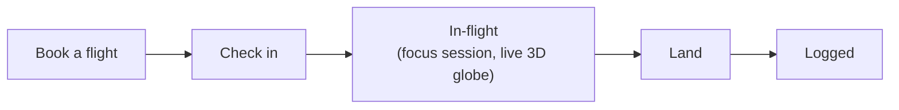

# Core loop

**Status: 🟢 decided — do not change.**

The unchanged session loop every mode is built on top of, and how
mode-selection attaches to the Hub without disturbing it.

## The loop

This is the entire product today and it works. Nothing in the
game-modes feature touches this flow, its screens, or its navigation
graph — every mode (Story, Free, Challenges) runs through the same
loop, just with different constraints on where it can start and what
it updates afterward. What "what it updates afterward" means concretely
— the mode tag every session carries, and what happens inside the
existing "Logged" step because of it — is canonical in
[mechanics.md](mechanics.md), not restated here.

## Hub entry points

### Today

Two entry points at the top level: "Book a flight" (→ Story Mode, the
only mode that exists) and the profile/account button.

### Mode-select addition

One more button next to the profile button. Booking a Story Mode
flight from the Hub's primary button stays exactly as it is — the new
button is a secondary, deliberate choice, not a replacement.

This matters because of the "study tool first" principle in the
[README](README.md): the fastest path to starting a normal session
must never get an extra tap added to it. Free Mode and Challenges are
opt-in detours, not the default.

Confirmed 2026-08-27 — the button opens a single menu covering both
non-Story modes, rather than a three-way Story/Free/Challenges picker:

- The **Challenges quest log**: list of active challenges (up to the
  cap of 3), with actions to start a new one (curated or custom) or
  abandon an existing one. See [challenges.md](challenges.md#entry--management-surface).
- A **Free Mode** entry point (see [free-mode.md](free-mode.md)).

Story Mode has no entry here — it isn't duplicated, since "Book a
flight" on the Hub's primary button is already its entry point. This
menu only needs to cover the two modes that don't have a home
elsewhere.

## Open items

None currently. Exact visuals/placement of the new button, and of the
quest-log menu itself, is a build-time detail, not a design decision —
defer to whoever implements Phase 1/2.
