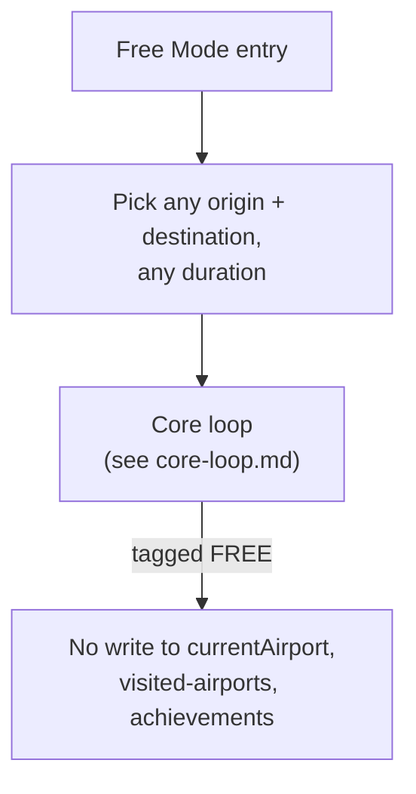

# Free Mode

**Status: 🟢 decided.**

The uncomplicated escape hatch: any airport, any duration, no
constraints, no persistent side effects.

## Problem it solves

You're stuck (narratively, in Story Mode) at an airport whose only
routes are 4h+ flights, but you just wanted to study for 30 minutes.

## Shape at a glance

## Mechanics

- Pick any origin and destination, any time — the Story Mode origin
  lock does not apply.
- Reuses the existing FlightSearch → CheckIn → InFlight screens,
  tagged with a `FREE` mode marker — no new UI needed beyond an entry
  point and removing the origin constraint.

## Isolation

Fully isolated from Story Mode progress (README principle #2): does
not touch `currentAirport`, visited-airports, country/continent
completion, or achievements — and does not advance active Challenges
either. Without that exclusion a Set-completion challenge like "visit
all continents" would become trivial (one 30-minute Free Mode hop to
an airport on each continent), which defeats the point of the
challenge asking for real committed travel.

**Free Mode flights still appear in the logbook.** Confirmed
2026-08-27: they're real, valid, logged flights — the core loop's
"Logged" step is unchanged — they just don't count toward anything
above. See [mechanics.md](mechanics.md) for the full tag/isolation
model shared across modes (this file's `FREE` tag is one row of that
table).

## Open items

None currently. This is the simplest of the three modes and the first
one that should get built once Phase 1 (mode plumbing) lands, since
it's the best validation that the plumbing works before building
anything more complex on top of it.
