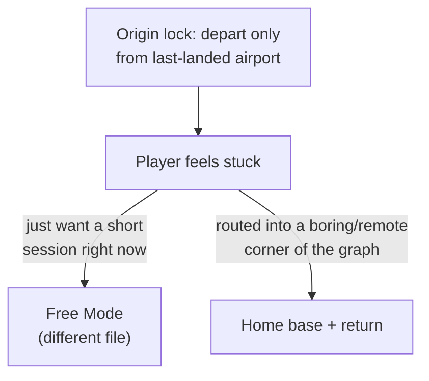

# Story Mode

**Status: 🟢 decided.**

The existing, permanent mode. Tracks all flights, drives achievements,
has "the story" via the origin-lock constraint. This file only covers
what's new — the origin-lock flow itself (booking, check-in, in-flight,
landing) is unchanged, see [core-loop.md](core-loop.md). Story Mode
flights are the `STORY` tag in [mechanics.md](mechanics.md)'s
isolation model — the default, full read/write case every other mode
is defined as a constrained variant of.

## Shape at a glance

Two different frustrations, two different fixes. Free Mode is a
session-duration escape valve (see [free-mode.md](free-mode.md)); home
base is a narrative escape valve. Don't conflate them.

## Origin lock

Existing, unchanged. You can only depart from the airport you last
landed at — the mechanic that makes Story Mode feel like a journey
instead of a menu.

### Rejected: fast-travel

Originally considered "depart from any previously-visited airport."
Rejected — it makes the origin-lock meaningless, since there'd be no
reason to ever not fast-travel to your favorite short route, and the
journey feeling dies. Replaced by home base + return below, a much
narrower escape valve.

## Home base + return

### Setting a home base

At onboarding (as today) the user picks a home base airport.

### Return (instant teleport)

The user can teleport home instantly from wherever they currently
are, subject to a 7-day cooldown (see [Cooldowns](#cooldowns)).

This reverses an earlier decision that return-home must be a real
(possibly multi-leg) flight, reusing the Route-challenge mechanic —
that would have removed the whole point of the feature as an escape
valve. Instant + cooldown is simpler to build, and was explicitly
chosen as a "try it, revisit if it doesn't feel right" call on the
teleport approach itself — though the 7-day cooldown length is a
deliberate choice, not a placeholder.

### Changing home base

The home base airport itself can be changed, but not freely — its own
separate 30-day cooldown, see [Cooldowns](#cooldowns).

## Cooldowns

Two distinct cooldowns gate two distinct actions — don't conflate
them:

| Action | Cooldown | Why |
|---|---|---|
| Return-home teleport | 7 days | Frequent enough to be a real escape valve, not frequent enough to replace the origin-lock's constraint |
| Change home base | 30 days | Rarer — this redefines the anchor point itself, not just a single trip back to it |

Changing home base needs no separate "grace change" mechanic for
onboarding mis-clicks: the last-changed timestamp is simply seeded to
31 days before onboarding when a home base is first set, so the very
first change is always immediately available through the same
cooldown check everyone else uses — no special-casing required.

## Future UI idea (not yet designed)

A temporary modal with an animation while the return-home teleport
happens, instead of an instant cut. Flagged for later, not a decision
to make now — just captured so it isn't lost.

## Open items

None currently.
