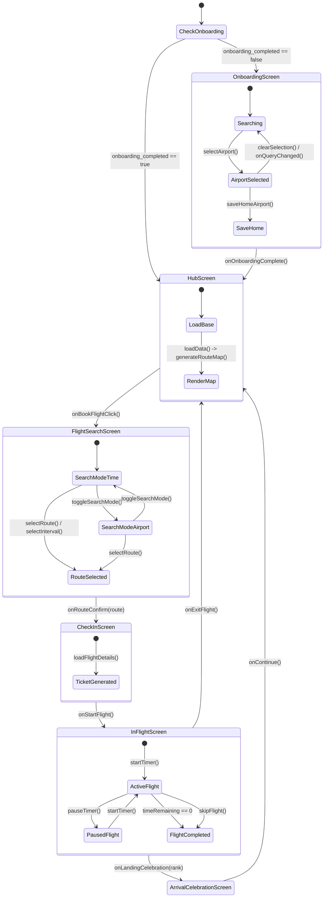
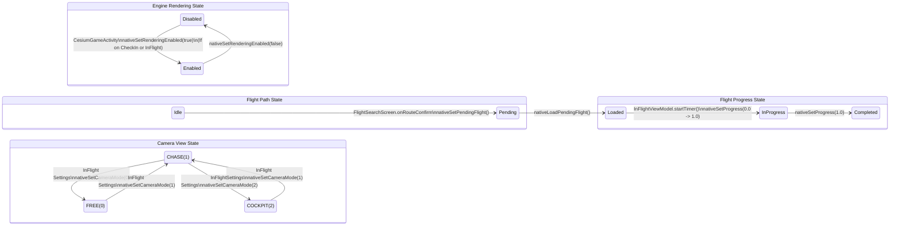

# Focusflight State Graph

This document maps out the state management and state-setting functions across the entire Focusflight application, including screen navigation, native engine controls, persistent data, and individual ViewModel states.

## 1. Overall Application State & Navigation

## 2. Cesium Engine & Native Bridge States

## 3. Persistent Storage States (PreferencesRepository)

| State Key | Set By Function | Triggered When |
| :--- | :--- | :--- |
| `onboarding_completed` | `setOnboardingCompleted()` | `OnboardingViewModel.saveHomeAirport()` |
| `home_airport_iata` | `setHomeAirport()` | `OnboardingViewModel.saveHomeAirport()` |
| `current_airport_iata` | `setCurrentAirport()` | 1. `OnboardingViewModel.saveHomeAirport()` 2. `FlightSearchViewModel.fetchRoutes()` (LHR fallback) 3. `InFlightViewModel.startTimer()` (on finish) 4. `InFlightViewModel.skipFlight()` |
| `flight_logs_set` | `saveFlightLog()` | `InFlightViewModel.saveFlightLogToPrefs()` (on flight complete/skip) |

## 4. ViewModel State Modifiers

### HubViewModel (Homescreen)
- **`currentAirport`**: Set by `loadData()` reading from Preferences
- **`flightStats`**: Set by `loadData()`
- **`routeMapPath`** (Homescreen Background Image): Set by `generateRouteMap()` which invokes `CesiumRSLibrary.renderRoutes()` and outputs a cached `.png` image path.
- **`isRendering`**: Toggled during `generateRouteMap()`

### OnboardingViewModel
- **`searchQuery`**: Set by `onQueryChanged()`, `selectAirport()`, `selectAirportByIata()`, `clearSelection()`
- **`searchResults`**: Updated by coroutine flow observing `_searchQuery`
- **`selectedAirport`**: Set by `selectAirport()`, `selectAirportByIata()`. Cleared by `clearSelection()` or mismatches in `onQueryChanged()`. Triggering this also triggers `preRenderMap()` cache rendering.

### FlightSearchViewModel
- **`originAirport`**: Set by `loadOrigin()`, or fallback in `fetchRoutes()`
- **`allRoutes` & `intervals`**: Set by `fetchRoutes()`
- **`selectedInterval` & `filteredRoutes`**: Set by `selectInterval()`, `resetState()`
- **`selectedRoute`**: Set by `selectRoute()`, auto-selected in `selectInterval()`, cleared when toggling modes.
- **`searchMode`**: Set by `toggleSearchMode()`, `resetState()`
- **`airportSearchQuery` & `airportSearchResults`**: Set by `onAirportSearchQueryChanged()`, `resetState()`

### CheckInViewModel
- **`originAirport` & `destAirport` & `routeDetails`**: All populated immediately upon `loadFlightDetails()` init block.

### InFlightViewModel
- **`originAirport` & `destAirport` & `routeDetails`**: Populated by `loadFlightDetails()`
- **`uiState`**: Contains time, speed, altitude, lat/lon, progress, isRunning, isCompleted.
  - Modifiers:
    - **`startTimer()`**: Main coroutine loop calculating elapsed time, pushing `nativeSetProgress` to Engine, reading `nativeGetTelemetry`, and updating `uiState`.
    - **`pauseTimer()`**: Cancels coroutine job, sets `isRunning = false`.
    - **`skipFlight()`**: Cancels coroutine job, sets completion states, triggers native progress 1.0, and triggers `preRenderDestinationMap()`.

## 5. File System & Cache States

### Map Caching (`CacheUtils` & `CesiumRSLibrary`)
The application generates route map images using a native Rust engine headless renderer, saving the output to the device's internal cache directory.

- **State Creation**:
  - `HubViewModel.generateRouteMap()` checks for an existing pre-rendered map file (`hub_route_map_{IATA}.png`). If absent, it invokes `CesiumRSLibrary.renderRoutes()` to generate one and saves it to the cache directory.
  - `OnboardingViewModel.preRenderMap()` does the same for the selected home airport during onboarding.
  - `InFlightViewModel.preRenderDestinationMap()` does the same for the destination airport upon flight completion or skip.
  
- **State Pruning (`CacheUtils.pruneMapCache`)**:
  - To prevent excessive storage use, `pruneMapCache(cacheDir, maxFiles = 5)` is triggered immediately after a new map is successfully generated or loaded.
  - It sorts the map cache files by `lastModified` and deletes the oldest files until the total count is $\le$ `maxFiles`.

### Database Initialization (`FlightDatabaseHelper`)
- **Initial Setup State**:
  - On first run (triggered via `CesiumGameActivity.onCreate`), `databaseHelper.ensureDatabaseCopied()` executes. 
  - It checks if the `flights.db` file exists in the app's databases directory. If it doesn't, it actively copies the pre-populated SQLite database from the app's `assets/` folder to the active local storage.

## 6. Ephemeral UI & Animation States (Jetpack Compose)

### Arrival Celebration Animations (`ArrivalCelebrationScreen`)
This screen manages a sequence of UI states to choreograph the landing animation and haptic feedback.
- **`planeOffsetY`**: Starts at `screenHeightPx * 0.7f` (off-screen bottom) and animates to `-screenHeightPx * 0.7f` (off-screen top) using a `CubicBezierEasing`.
- **`stampLanded`**: A boolean state that flips to `true` exactly 750ms after the plane animation begins (simulating the moment it exits the screen).
- **`stampScale` & `stampAlpha`**: Reactive states tied to `stampLanded`. The stamp scales down from `5f` to `1f` using a spring animation, and fades in from `0f` to `1f`, coinciding with the system haptic touchdown feedback.

### Search Navigation & Pagination (`FlightSearchScreen`)
- **`listState` (Timeline Slider)**: Tracks the scroll position of the intervals. It uses a custom `rememberInertiaSnapFlingBehavior` to snap to the closest interval and updates the ViewModel's `selectedInterval` when a new interval settles in the center.
- **`pagerState` (Flight Cards)**: Tracks the horizontally paging flight options. It is bidirectionally synchronized with the ViewModel's `selectedRoute`: swiping the pager updates the ViewModel, and selecting an interval in the timeline resets the pager to index 0.

## 7. Hardware & System States

### Audio Generation (`EngineSoundManager`)
The `InFlightScreen` generates continuous, procedural cabin rumble.
- **State**: `isPlaying` flag and `AudioTrack` instance.
- **Trigger**: Managed via a `DisposableEffect` observing the `soundEnabled` UI toggle. When enabled, it spawns a background thread that calculates a composite sine wave (80Hz + 40Hz + white noise) and streams raw PCM data directly to the hardware audio buffer.

### Screen Wakelocks
- **`CesiumGameActivity`**: Uses `window.addFlags(WindowManager.LayoutParams.FLAG_KEEP_SCREEN_ON)` upon creation to prevent the device from sleeping globally.
- **`InFlightScreen`**: Also applies the same wakelock explicitly via a `DisposableEffect` scoped to the flight duration, ensuring the screen stays alive even if the user leaves the device untouched during long simulated flights.

## 8. Edge Cases & Fallback States

### Route Fallbacks (`FlightSearchViewModel`)
- **Scenario**: The user's saved `home_airport_iata` has no outgoing routes in the database.
- **Fallback State Modifier**: When `fetchRoutes()` returns an empty list for the current origin, the ViewModel actively intercepts this state. It fetches "LHR" (London Heathrow) from the database, overwrites the `_originAirport` flow, and permanently overwrites the `current_airport_iata` in the `PreferencesRepository`. It then re-runs the route fetch for LHR so the UI always has content to display.

### Cache Missing Fallbacks
- **Scenario**: The `routeMapPath` points to a file, but the file doesn't exist or is empty.
- **Fallback**: The `generateRouteMap` safely deletes the empty file and triggers the native headless renderer to rebuild it, while the UI simply falls back to rendering a solid background color in the interim.
